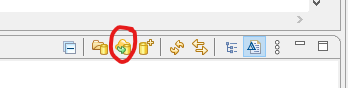
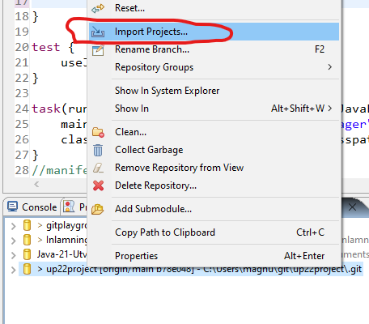

# Internationall football team manager application

Provides a simple java application for managing internationall football teams, players, coaches and matches. 

Included a console menu interface to interact with the application.  

## How to Clone and Build

###Eclipse

Open the Git Repositories view (Window > Show View > Other... > Git > Git Repositories).

Clone the repository (se pic below). 

Provide the following Git repository location in the URI field:

    https://github.com/MagLilja/up22project.git

Choose Next > Next

Specify 'Destination Directory' if other than default is wanted.

Lastly press 'Finish' to clone the repository. 

Then right click on the GIT repository in the list and choose 'Import Projects...'

## How to run the application
Use the following options to run the application. 

Run the following Maven Goal

    Run tests: mvn test
    

The build system also expects find your python interpreter by using /usr/bin/env python,
if this doesn't work you will get problems.

To resolve this, modify the #! lines in the .dbuild/pretty/*.py files.

Hope this helps.