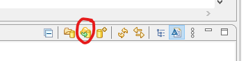
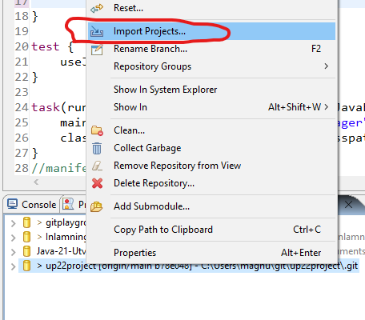
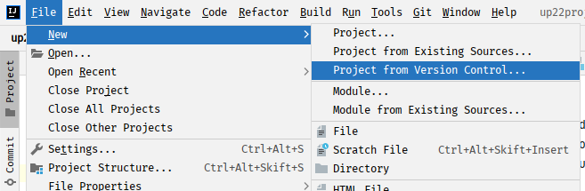
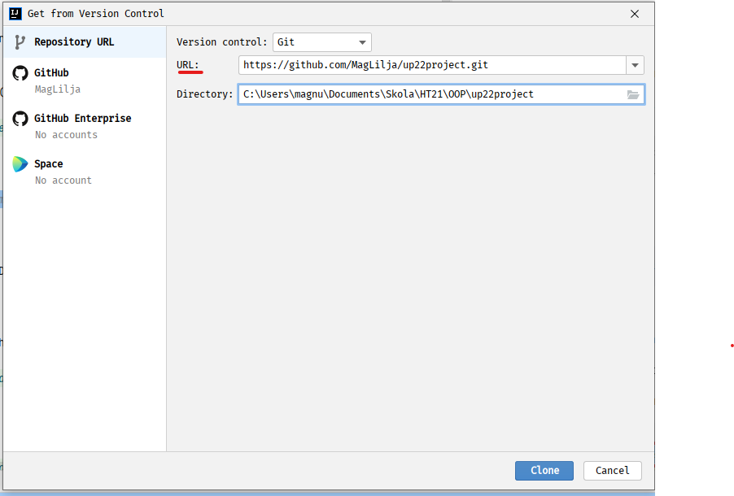

# Internationall football team manager application

Provides a simple java application for managing internationall football teams, players, coaches and matches. 

Included a console menu interface to interact with the application.  

## How to Clone and Build

##Eclipse

Open the Git Repositories view (Window > Show View > Other... > Git > Git Repositories).

Clone the repository (se pic below). 

Provide the following Git repository location in the URI field:

    https://github.com/MagLilja/up22project.git

Choose Next > Next

Specify 'Destination Directory' if other than default is wanted.

Lastly press 'Finish' to clone the repository. 

Then right click on the GIT repository in the list and choose 'Import Projects...'

##IntelliJ

Create new project from Version Control

Provide the following Git repository location in the URI field and click 'Clone':

    https://github.com/MagLilja/up22project.git

## Build
Use the following to build the application.

    mvn package

## How to run the application
After building use one of the following options to run the application. 

Option 1. Run the following Maven Goal to run the application with Maven:

    mvn exec:java

Option 2. Run the following in the terminal to execute the JAR-file:

    java -jar ./target/up22project-1.0-SNAPSHOT.jar

(target directory format can be different depending on terminal shell)

#Hope this helps!